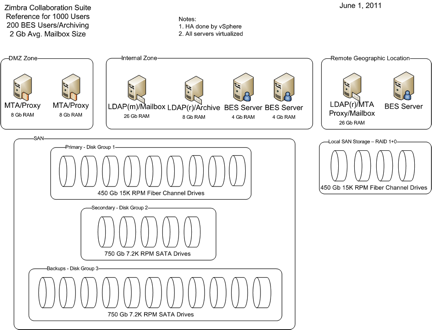

= Role Based Server Hardware Configuration and Placement

This reference architecture for 1,000 users provides client access via a load balanced Virtual IP address through redundant servers located in an Internet-facing security zone, typically called a DMZ.

MTA and Proxy services will be located in the DMZ that are required to handle connectivity to the outside world.

The proxy service will offload SSL traffic and proxy all HTTP, POP, and IMAP traffic to the mailbox store services. Many customers also use the load-balancer as an SSL-offload and this helps improve performance.

The Zimbra LDAP services will provide configuration information required to run the Zimbra Collaboration Suite.  Authentication Services can be provided by the Zimbra LDAP service, the customer’s Active Directory domain controllers, or an external LDAP service on a per domain basis.

The Mailbox Servers store email, calendar, address book, documents, and briefcase for each user. The Zimbra LDAP Servers and the Mailbox Store Servers will reside in the customer’s Internal Security Zone.

*`--> change the image quality .. needs to be redrawn`*

.Server Configuration and Placement

